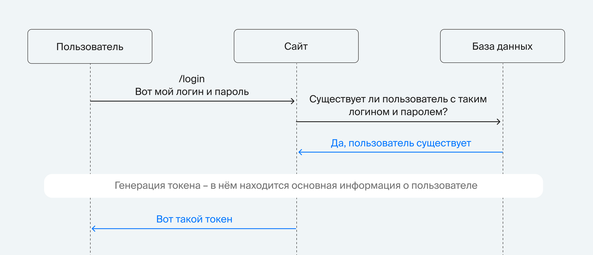
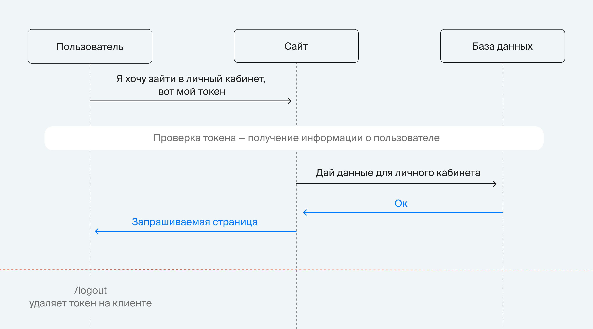
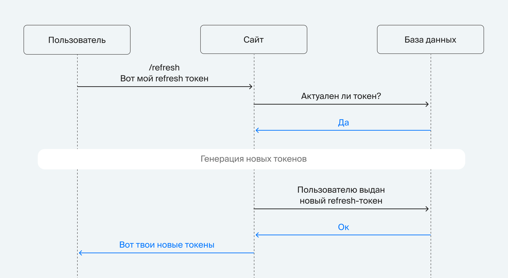

# Сервис авторизации 

## Архитектура сервиса

- Приложение FastAPI - принимает запросы, валидирует входные данные, возвращает ответы
- PostgresSQL - хранилище информации о пользователе (id, login, password, first_name, last_name, created_at) и RefreshToken
- Redis - хранилище недействительных access-токенов

## Приложение FastAPI 

Обрабатывает запросы 

- от клиента на аутентификацию и сброс токена;
- от остальных микросервисов в рамках нашего проекта на авторизацию;
- от других сервисов.

API для сайта и личного кабинета:

`/auth/`
- `signup/` регистрация пользователя;
- `login/` вход пользователя в аккаунт (обмен логина и пароля на пару токенов: JWT-access токен и refresh токен);
- `refresh/` выдача новой пары токенов в обмен на корректный refresh-токен, обновление access-токена; 
- `logout/` выход пользователя из аккаунта;

API для управления доступами:

`/roles/`
- роли пользователя в виде ENUM;
- `grant/` назначить пользователю роль;
- `revoke/` отобрать у пользователя роль;
- `check/` метод для проверки наличия прав у пользователя.

### JWT токен

AccessToken

Access token с коротким временем жизни (10-15 минут или несколько часов) — многоразовый. Он содержит информацию о пользователе.

RefreshToken

Refresh token с долгим временем жизни (от нескольких дней до месяца) — одноразовый. Список актуальных refresh-токенов должен храниться в базе данных, чтобы соблюсти «одноразовость».

## Cтруктура репозитория

Корень проекта — в нём находится всё базовое, например, Dockerfile, requirements.txt и gitignore.

- src — содержит исходный код приложения.
- main.py — входная точка приложения.
- api — модуль, в котором реализуется API. Другими словами, это модуль для предоставления http-интерфейса клиентским приложениям. Внутри модуля отсутствует какая-либо бизнес-логика, так как она не должна быть завязана на HTTP.
- core — содержит разные конфигурационные файлы.
- db — предоставляет объекты баз данных (Redis, PostgreSQL) и провайдеры для внедрения зависимостей.
- models — содержит классы, описывающие бизнес-сущности и модели базы данных.
- services — главное в сервисе: здесь находится реализация всей бизнес-логики.
